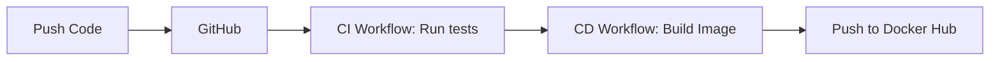

# CI/CD Pipeline Demo Project

This project demonstrates a real, working CI/CD pipeline using a Python Flask API, Docker, and GitHub Actions.

## What is CI/CD?
Continuous Integration (CI) and Continuous Deployment (CD) are practices that automate software delivery. In simple terms, **CI means every push to the repository is automatically built and tested** to ensure no code breaks. **CD means every merge to the main branch is automatically packaged into a release and deployed** (in this case, built as a Docker container and published to Docker Hub) without manual intervention.

## What this project does
This project provides a working Python Flask REST API that manages a simple task list. It is fully containerized using a multi-stage Docker build, and we use GitHub Actions to automate its testing and deployment lifecycle. Every push triggers our CI workflow, and every change to the main branch pushes an updated, versioned Docker image.

## Architecture Diagram



## Prerequisites
- **Docker**: To run the project locally.
- **Python 3.11**: If you want to develop and run tests locally without Docker.
- **GitHub Account**: To host the code and run the pipelines.
- **Docker Hub Account**: To store the published Docker images.

## Running the Application

### How to run locally
Ensure Docker is running, then use Docker Compose:
```bash
docker-compose up -d --build
```
The application will be accessible at http://localhost:5000.

### How to run tests locally
First, install the requirements, then run pytest:
```bash
pip install -r app/requirements.txt
pytest app/tests/ -v
```

## GitHub Actions Workflows

### Setting up GitHub Secrets
To allow GitHub Actions to push images to your Docker Hub account, you need to configure two secrets in your repository:
1. Go to your GitHub repository -> **Settings** -> **Secrets and variables** -> **Actions**.
2. Click **New repository secret**.
3. Add a secret named `DOCKERHUB_USERNAME` and paste your Docker Hub username.
4. Add another secret named `DOCKERHUB_TOKEN` and paste a Docker Hub Personal Access Token (generate this in Docker Hub -> Account Settings -> Security).

### Pushing to the `main` branch
When you push code to the `main` branch, the full pipeline runs:
1. **CI Workflow**: Code is checked out, dependencies are cached and installed, and the pytest suite runs. If tests fail, the pipeline stops here.
2. **CD Workflow**: If tests pass, GitHub logs into Docker Hub using your secrets, extracts metadata to tag your image, and builds a multi-architecture (amd64, arm64) Docker image.
3. **Publish**: The image is pushed to Docker Hub, and you can see the results and the image digest directly in the GitHub Actions job summary.

### Pushing to a feature branch
When you push to any branch other than `main`, **only the CI workflow runs**. It will run the unit tests and perform a trial Docker build to ensure your changes are healthy and won't break the build later. The CD process does not trigger, meaning no image is published.

## Downloading the Published Image
Once the pipeline has published your image to Docker Hub, you can pull and run it directly:
```bash
docker pull <username>/cicd-pipeline-demo:latest
docker run -p 5000:5000 <username>/cicd-pipeline-demo:latest
```
*(Replace `<username>` with your actual Docker Hub username).*

## Multi-stage Docker Builds
This project uses a multi-stage `Dockerfile` to dramatically reduce the final image size and improve security. 
- **Stage 1 (Builder)**: This stage contains all the build tools needed to install dependencies (like `pip`).
- **Stage 2 (Final)**: We copy *only the installed packages* and our application code into a fresh, minimal Python environment. We intentionally leave out the `tests` directory and any extra build tools from Stage 1. This keeps the final production container extremely lightweight.

## Security: Why the non-root user matters
In the Dockerfile, we create and switch to a non-root user (`appuser`). If an attacker were to somehow exploit a vulnerability in the Flask application, running as root would give them full control over the container, and potentially the host machine. Running the app as a restricted user significantly mitigates this risk and is considered a Docker security best practice.

## Common Pipeline Failures & Fixes

1. **Tests Failing**: The CI pipeline fails during the `pytest` step.
   *Fix*: Run the tests locally using `pytest app/tests/ -v` to identify which endpoint or logic is broken. Fix the code and push again.
2. **Docker Build Fails**: Often caused by a typo in `requirements.txt` or missing OS-level dependencies.
   *Fix*: Run `docker build .` locally to catch build errors before pushing.
3. **Authentication Failure (401 Unauthorized)**: The CD pipeline fails during the "Log in to Docker Hub" step.
   *Fix*: Ensure your `DOCKERHUB_USERNAME` and `DOCKERHUB_TOKEN` secrets are correctly configured in GitHub and haven't expired.
